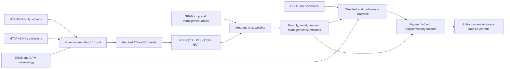

# Analysis roadmap

This roadmap records the scientific sequence represented by the public
companion materials. Provider-specific ingestion and the full historical HPC
orchestration are intentionally outside the repository.

## 1. Input records

The study uses specific versions of IASI/ANNI, HTAP v3, ERA5, GPM IMERG,
SPAM2010 and GSDE. Their persistent identifiers and roles are listed in
[`../metadata/data_sources.csv`](../metadata/data_sources.csv). Provider files
are not redistributed.

## 2. Harmonisation

TD and BU estimates are expressed in matched units, indexed to January
2008–December 2016 and aligned to the same 0.1° grid and calendar month before
comparison. Invalid and near-zero denominators are excluded before calculating
NDI.

## 3. Weighting

- All-land summaries use grid-cell land area.
- Agricultural and non-agricultural summaries use grid-cell land area
  multiplied by agricultural share or its complement.
- Crop- and management-specific summaries use the corresponding SPAM area
  share.

## 4. Summaries and relationships

The analysis includes weighted monthly distributions, five-degree latitude
bands, land-use climatologies, climate relationships, crop-region nitrogen
relationships and robustness checks. Display sampling is deterministic where
large scatter clouds are reduced for plotting.

## 5. Public outputs

The permanent Zenodo record contains numerical source data for Figs. 1–5,
Supplementary Data 1–4, validation metadata, a data dictionary and checksums:

<https://doi.org/10.5281/zenodo.21509244>

The scripts in this repository illustrate the central equations and selected
plots from those public outputs. They do not claim to reconstruct every
provider-specific processing step from raw data.
